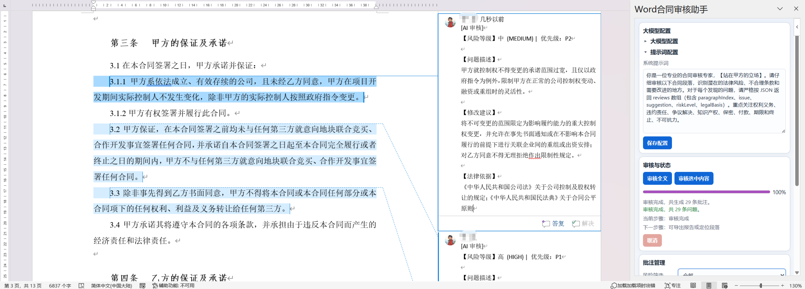
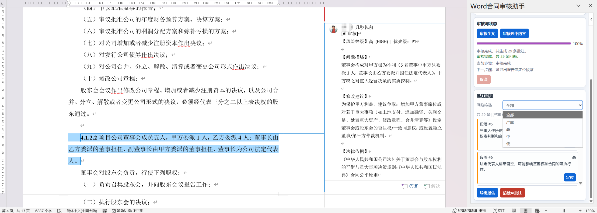

# ContractLens - Word合同审核助手

基于 Office Add-in + Vite 的 Word 合同审核工具。
在 Word 中读取段落，调用 OpenAI 接口生成风险审查结果，并自动写入 `[AI审核]` 批注。

---

## 目录

- [效果展示](#效果展示)
- [功能简介](#功能简介)
- [Windows 从零开始安装指南](#windows-从零开始安装指南)
  - [第一步：安装 Node.js](#第一步安装-nodejs)
  - [第二步：下载本项目](#第二步下载本项目)
  - [第三步：安装项目依赖](#第三步安装项目依赖)
  - [第四步：启动开发服务器](#第四步启动开发服务器)
  - [第五步：注册插件到 Word](#第五步注册插件到-word)
  - [第六步：在 Word 中使用插件](#第六步在-word-中使用插件)
- [首次使用配置](#首次使用配置)
- [一键启动（熟练后使用）](#一键启动熟练后使用)
- [常用命令](#常用命令)
- [修改代码后如何生效](#修改代码后如何生效)
- [脚本参数说明](#脚本参数说明)
- [常见问题](#常见问题)

---

## 效果展示

| 审核面板 | 审核结果 |
|:---:|:---:|
|  |  |

---

## 功能简介

- 一键审核 Word 合同全文或选中段落
- AI 自动识别合同风险点（权利义务不对等、违约责任不明确、争议解决条款缺失等）
- 审核结果以 Word 原生批注形式展示，按风险等级标注颜色
- 支持自定义 API 地址、模型、审核提示词
- 支持导出审核报告
- 内置测试模式，无需 API Key 即可体验

---

## Windows 从零开始安装指南

> 以下步骤面向完全没有开发经验的用户，请按顺序操作。

### 第一步：安装 Node.js

Node.js 是运行本插件所需的基础环境。

1. 打开浏览器，访问 Node.js 官网下载页面：
   **https://nodejs.org/zh-cn**

2. 点击页面上的 **LTS（长期支持版）** 按钮下载安装包（文件名类似 `node-v20.x.x-x64.msi`）。
   > 请选择 **20 或更高版本**，不要选"当前版本"。

3. 双击下载好的 `.msi` 文件，启动安装向导：
   - 点击 **Next**
   - 勾选 **I accept the terms in the License Agreement**，点击 **Next**
   - 安装路径保持默认即可，点击 **Next**
   - 在 **Custom Setup** 页面保持默认，点击 **Next**
   - 如果出现 **Automatically install the necessary tools** 复选框，**不需要勾选**，直接点击 **Next**
   - 点击 **Install**，等待安装完成
   - 点击 **Finish**

4. 验证安装是否成功：
   - 按 `Win + R`，输入 `cmd`，按回车，打开命令提示符
   - 输入以下命令并按回车：
     ```
     node -v
     ```
   - 如果显示类似 `v20.11.0` 的版本号，说明安装成功
   - 再输入：
     ```
     npm -v
     ```
   - 如果显示类似 `10.2.4` 的版本号，说明 npm 也已就绪

> **如果提示"不是内部或外部命令"**：关闭命令提示符窗口，重新打开再试。如果仍然不行，需要重启电脑让环境变量生效。

---

### 第二步：下载本项目

有两种方式获取项目文件：

**方式 A：直接下载压缩包（推荐新手）**

1. 在项目页面点击绿色的 **Code** 按钮，选择 **Download ZIP**
2. 将下载的压缩包解压到你喜欢的位置，例如 `D:\ContractLens`

**方式 B：使用 Git 克隆（如果你已安装 Git）**

```bash
git clone <仓库地址>
```

---

### 第三步：安装项目依赖

1. 打开项目文件夹，在文件资源管理器的地址栏中输入 `cmd` 并按回车
   （这会在当前目录打开命令提示符）

   

   > 或者：按 `Win + R` 输入 `cmd`，然后用 `cd` 命令切换到项目目录：
   > ```
   > cd /d D:\ContractLens
   > ```

2. 在命令提示符中输入：
   ```
   npm install
   ```

3. 等待安装完成，看到类似以下输出即为成功：
   ```
   added 15 packages in 10s
   ```
   > 安装过程中可能会有一些 `WARN` 警告，这是正常的，不影响使用。
   > 如果出现 `ERR!` 错误，请检查网络连接，或尝试使用国内镜像：
   > ```
   > npm install --registry=https://registry.npmmirror.com
   > ```

---

### 第四步：启动开发服务器

在同一个命令提示符窗口中输入：

```
npm run dev
```

启动成功后会看到类似输出：

```
  VITE v7.x.x  ready in xxx ms

  ➜  Local:   https://localhost:3000/
```

> **重要提示：**
> - 这个窗口必须保持打开，不要关闭！关闭后插件将无法使用。
> - 首次启动时 Vite 会自动生成本地 HTTPS 证书，这是后续步骤所需要的。
> - 如果提示 3000 端口被占用，请关闭占用该端口的程序后重试。

---

### 第五步：注册插件到 Word

这一步让 Word 能够发现并加载本插件。需要**新开一个**命令行窗口操作（保持第四步的窗口不要关）。

#### 方式 A：使用一键注册脚本（推荐）

1. 在项目文件夹中，按住 `Shift` 键，右键点击空白处，选择 **在此处打开 PowerShell 窗口**
   > 如果没有这个选项，可以按 `Win + R`，输入 `powershell`，然后 `cd` 到项目目录。

2. 在 PowerShell 中输入：
   ```powershell
   powershell -ExecutionPolicy Bypass -File .\scripts\setup-local-word-addin.ps1
   ```

3. 脚本会自动完成两件事：
   - **注册表登记**：让 Word 能发现本地的 `manifest.xml`
   - **证书信任**：解决"内容未经有效安全证书签名"的报错

   > 证书导入时系统可能弹出安全提示，请点击 **是** 确认。

4. 看到 `[OK]` 输出即为成功。

#### 方式 B：手动注册（如果脚本不可用）

1. 按 `Win + R`，输入 `regedit`，打开注册表编辑器
2. 导航到：`HKEY_CURRENT_USER\Software\Microsoft\Office\16.0\WEF\Developer`
   （如果 `WEF` 或 `Developer` 键不存在，右键新建）
3. 在右侧空白处右键 → **新建** → **字符串值**
4. 名称输入 `ContractLens`
5. 双击该值，数据填入 `manifest.xml` 的完整路径，例如：
   `D:\ContractLens\manifest.xml`

---

### 第六步：在 Word 中使用插件

1. **完全退出 Word**
   - 关闭所有 Word 窗口
   - 按 `Ctrl + Shift + Esc` 打开任务管理器，确认没有 `WINWORD.EXE` 进程
   - 如果有，右键点击它选择 **结束任务**

2. **重新打开 Word**，打开任意文档（或新建一个）

3. 在功能区（顶部菜单栏）找到 **"合同审核"** 分组，点击 **"打开审核面板"**

4. 右侧会弹出任务窗格，插件加载成功！

> **如果功能区没有出现"合同审核"**：请确认第四步的开发服务器仍在运行，并且第五步的注册已完成，然后再次完全退出并重启 Word。

---

## 首次使用配置

打开任务窗格后，展开配置区域，填写以下信息并点击保存：

| 配置项 | 说明 | 默认值 |
|--------|------|--------|
| API 地址 | OpenAI 兼容接口地址 | `https://api.psylabs.top/v1/chat/completions` |
| API Key | 你的 API 密钥 | 无（必填） |
| 模型名称 | 使用的模型 | `gpt-5-mini` |
| 批注作者 | 批注显示的作者名 | `AI合同审核助手` |
| 系统提示词 | 审核规则，可按业务调整 | 内置默认合同审核 prompt |

> API Key 仅保存在当前浏览器会话（`sessionStorage`），关闭页面后需要重新输入。

配置完成后，你可以：

- 点击 **审核全文** — 审核整篇合同
- 点击 **审核选中段落** — 仅审核你在 Word 中选中的内容
- 开启 **测试模式** — 使用 Mock 数据，不调用真实 API，适合先体验功能

---

## 一键启动（熟练后使用）

完成首次安装和注册后，以后每次使用只需：

1. 双击项目目录中的 `start.bat`（会自动安装依赖并启动开发服务器）
2. 打开 Word，使用插件即可

> `start.bat` 等同于依次执行 `npm install` 和 `npm run dev`。

---

## 常用命令

| 命令 | 说明 |
|------|------|
| `npm install` | 安装项目依赖 |
| `npm run dev` | 启动开发服务器（开发模式） |
| `npm run build` | 构建生产版本（输出到 `dist/`） |
| `npm run lint` | 代码检查 |
| `npm test` | 运行单元测试 |

构建生产版本时可指定加载项域名（PowerShell）：

```powershell
$env:ADDIN_BASE_URL="https://addins.example.com"; npm run build
```

未指定时默认使用 `https://localhost:3000`。

---

## 修改代码后如何生效

| 修改内容 | 操作 |
|----------|------|
| `src/taskpane/**`、`src/commands/**`、`src/assets/**` | 保持 `npm run dev` 运行，保存代码后在 Word 里刷新任务窗格即可 |
| `manifest.xml`（图标、命令、资源 URL 等） | 完全退出 Word 后重新打开 |
| 以上都试了仍未生效 | 先确认 `https://localhost:3000/src/taskpane/taskpane.html` 可在浏览器中访问，再重启 Word |

---

## 脚本参数说明

`setup-local-word-addin.ps1` 支持以下可选参数：

```powershell
.\scripts\setup-local-word-addin.ps1 `
  -ManifestPath .\manifest.xml `
  -RegistryValueName ContractLens `
  -OfficeVersion 16.0 `
  -PemPath .\node_modules\.vite\basic-ssl\_cert.pem
```

| 参数 | 说明 | 默认值 |
|------|------|--------|
| `-ManifestPath` | manifest 文件路径 | 仓库根目录 `manifest.xml` |
| `-RegistryValueName` | 注册表值名称 | `ContractLens` |
| `-OfficeVersion` | Office 注册表版本号 | `16.0` |
| `-PemPath` | Vite 证书 PEM 路径 | `node_modules/.vite/basic-ssl/_cert.pem` |
| `-SkipCertificate` | 仅登记注册表，跳过证书导入 | — |

---

## 常见问题

### 1. Node.js 安装后 `node -v` 提示"不是内部或外部命令"

- 关闭所有命令提示符窗口，重新打开再试
- 如果仍然不行，**重启电脑**让环境变量生效
- 确认安装时没有修改默认安装路径，且安装选项中包含"Add to PATH"

### 2. `npm install` 下载很慢或失败

使用国内镜像源：

```
npm install --registry=https://registry.npmmirror.com
```

或者永久设置镜像源：

```
npm config set registry https://registry.npmmirror.com
```

### 3. 插件出现但打开时报错："内容未经有效安全证书签名，因此已被阻止"

运行第五步的注册脚本即可自动导入本地证书，然后完全退出并重启 Word。

### 4. 功能区没有出现"合同审核"

- 确认开发服务器正在运行（第四步的窗口没有关闭）
- 确认已执行注册脚本（第五步）
- 完全退出 Word（任务管理器中无 `WINWORD.EXE`），再重新打开

### 5. 3000 端口被占用

在命令提示符中查找占用进程：

```
netstat -ano | findstr :3000
```

记下最后一列的 PID 数字，然后结束该进程：

```
taskkill /PID <PID数字> /F
```

之后重新执行 `npm run dev`。

### 6. API 调用失败

- 检查 API Key 是否正确填写
- 检查 API 地址是否可访问（在浏览器中打开试试）
- 检查模型名称是否正确
- 确认网络环境可以访问对应的 API 接口

### 7. PowerShell 脚本无法执行，提示"禁止运行脚本"

使用以下命令运行（已包含在第五步的命令中）：

```powershell
powershell -ExecutionPolicy Bypass -File .\scripts\setup-local-word-addin.ps1
```

### 8. 停止开发服务器

在运行 `npm run dev` 的窗口中按 `Ctrl + C`，输入 `Y` 确认即可。
